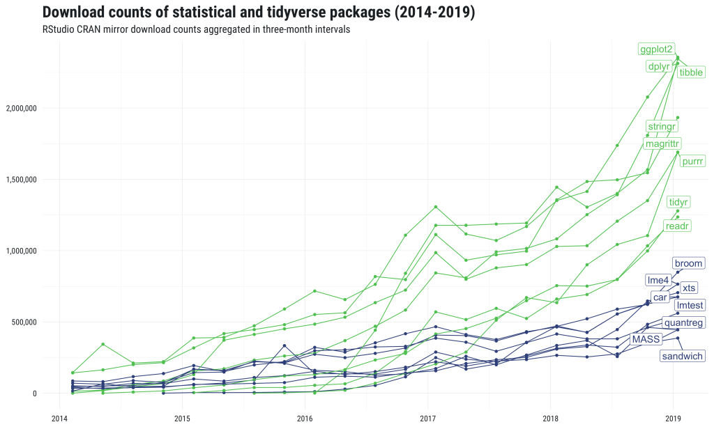

```{css, echo=FALSE}
.source_style {
  max-width: 300px;
  background-color: #5cb85c;
}

.output_style {
  max-width: 500px;
  background-color: #5cb85c;
}

```

```{r setup, include=FALSE,}
knitr::opts_chunk$set(class.source = ".source_style")
```

# R, RStudio et l'extension tidyverse

## Pourquoi utiliser R du début à la fin du traitement de données ? 

<div class="double">
<p class="double-flow">
**R** est un logiciel :
<pre>
<font size="5">
- multiplateforme (Linux, Mac OS X ou Windows); 
\
- libre et gratuit;
\
- très puissant;
\
- le développement est très actif;
\
- excellentes capacités graphiques.
</font>
</p><p class="double-flow">

<pre>
<b>
Gratuité / Reproductibilité / Rigueur Scientifique / Transparence / Documentation
</b>
</p>
</div>


## RStudio

<div class="double">
<p class="double-flow">
<strong>
Environnement de développement intégré (IDE) pour R
<pre>
</strong>
- propose des outils et facilite l'écriture de scripts
<i>
<p style="font-size:small;">"il n’y a pas d’obligation à utiliser RStudio, mais il y a une obligation à ne pas utiliser les interfaces de R par défaut.", [Hadrien Commenges](https://elementr.hypotheses.org/237)</p>
</i>
</p><p class="double-flow">

</p>
</div>

# Prise en main 

## La console


\- `>` : invite de commande (prompt) 

```{r, eval=FALSE}
> 2 + 2
#[1] 4

```

## Précisions concernant la saisie des commandes

\- les espaces autour des opérateurs n’ont pas d’importance

```{r, eval=FALSE}
> 10+2
> 10 + 2
> 10       +       2
```

\- Exécuter en appuyant sur `Ctrl + Entrée`.

\- R remplace l’invite de commande habituel par un signe `+` dans le cas d'une commande incomplète

```{r,  eval=FALSE}
> 4 *
+
```


## Objets

__Objets simples :__

```{r,  eval=TRUE}
# Stocker la valeur 2 dans un objet x
x <- 5
x
# Réutiliser cet objet dans d'autres opérations
x * 2
# Créer autant d'objets qu'on le souhaite
y <- 5
resultat <- x + y
resultat

```

## Objets

\- les noms d'objets peuvent contenir des lettres, des chiffres et les symboles `.` et `_`

\- R fait la différence entre minuscules et majuscules dans les noms d'objets : `resultat` et `Resultat` sont deux objets différents

```{r,  eval=TRUE}
# les objets n'ont pas de mémoire
x <- 5
x <- 3
x 
# les objets peuvent contenir tout un tas d'information
Prenom <- "Ahmed"
Prenom
  
```

## Objets

__Vecteurs :__

\- Stocker un ensemble de valeurs dans un seul objet, de type _vecteur_ :

```{r,  eval=TRUE}
# Exemple d'un vecteur avec des données sur l'âge pour 5 personnes
Ages <- c(25, 27, 18, 31, 22)
Ages
# Appliquer des opérations de bases sur un vecteur
Ages + 10
Ages^2
  
```

## Objets

__Vecteurs :__
 
```{r,  eval=TRUE}
# Un vecteur de châines de caractères
Diplome <- c("CAP", "BAC+3", "BAC", "BAC+5", "BAC")
Diplome
# Accéder à un élément particulier
Diplome[3]
  
```

## Fonctions

\- On utilise des fonctions pour effectuer des calculs, obtenir des résultats et accomplir des actions.

\- Une fonction a un _nom_, elle prend en entrée entre parenthèses un ou plusieurs __arguments__, et retourne un __résultat__.


```{r,  eval=TRUE}
# Exemples de fonctions pré-définies
## Nb d'éléments du vecteur Ages

length(Ages)

```

## Fonctions

```{r,  eval=TRUE}
## min et max des âges
min(Ages)
max(Ages)
## la moyenne des âges
mean(Ages)
## la somme des âges
sum(Ages)
```

```{r,  eval=FALSE}
## Aide sur une fonction
help("mean")
```

## Les Scripts

\- Regrouper les commandes dans un seul fichier (un Script)

\- Pour créer un script : `File` -> `New File` -> `R Script` (Ctrl+Shift+N)

```{r, eval=FALSE}

# Exemple d'un script R 

## Données
Ages <- c(25, 27, 18, 31, 22)
Diplome <- c("CAP", "BAC+3", "BAC", "BAC+5", "BAC")

## Stat desc
mean(Ages)
table(Diplome)

## Base de données
data <- cbind(Diplome, Ages)
data

## Age moyen par catégorie du diplôme (exercice !!)

```

## Installer/Charger des packages

\- La plupart des extensions sont développées et maintenues par la communauté des utilisateurs de R, et diffusées via un réseau de serveurs nommé CRAN (_Comprehensive R Archive Network_).

\- Pour installer une extension, on peut utiliser le bouton _install_ de l'onglet _Packages_ de __RStudio__.


## Installer/Charger des packages

\- On peut aussi installer des packages en utilisant la fonction `install.packages()` directement dans la console :

```{r,  eval=FALSE}
> install.packages("tidyverse")
```

\- Une fois le package installé, il faut le charger (chaque fois) avant le pouvoir utiliser :

```{r,  eval=FALSE}
> library(tidyverse)
```

\- On regroupe souvent en début de script toute une série d'appels à `library`.


## Le tidyverse 

<div class="double">
<p class="double-flow">
<font size="4">
- Ensemble d’extensions pour R, construites autour d’une philosophie commune et conçues pour fonctionner ensemble. \
- Faciliter l’utilisation de R dans les domaines les plus courants : manipulation des données, recodages, production de graphiques, etc.
</font>

</p><p class="double-flow">

</p>
</div>



## Le tidyverse 

\- Les extensions qui constituent le coeur du `tidyverse` :


## tidy data

Les principes d'un jeu de données _tidy_ sont les suivants :

\* chaque variable est une colonne

\* chaque observation est une ligne

\* chaque type d'observation est dans une table différente


## tibbles

<p style="font-size:small;">
Une évolution moderne du classique _data frame_ du R de base, les tibbles :

\- n'ont pas de noms de lignes (rownames)

\- autorisent des noms de colonnes invalides pour les _data frames_ (espaces, caractères spéciaux, nombres ...)

\- s'affichent plus intelligemment que les _data frames_ : seules les premières lignes sont affichéées, ains que qlq informations supp utiles (dimension, types de colonnes...)

## tibbles

```{r,  eval=TRUE, warning=FALSE, message=FALSE, error=FALSE}
library(tidyverse)
as_tibble(iris)
```

## Solution exercice

```{r, eval=FALSE}

# Exemple d'un script R 
library(tidyverse)
library(dplyr)

## Données
Ages <- c(25, 27, 18, 31, 22)
Diplome <- c("CAP", "BAC+3", "BAC", "BAC+5", "BAC")

## Stat desc
mean(Ages)
table(Diplome)

## Base de données
mat <- cbind(Diplome, Ages)
data <- as.data.frame(mat)
data

## Age moyen par catégorie du diplôme
data$Ages <- as.numeric(data$Ages)

data %>% 
  group_by(Diplome) %>% 
  summarise(Age_m = mean(Ages))

```

