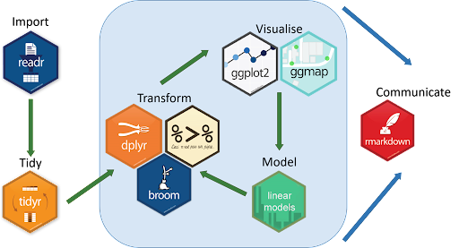

```{css, echo=FALSE}
.source_style {
  max-width: 300px;
  background-color: #5cb85c;
}

.output_style {
  max-width: 500px;
  background-color: #5cb85c;
}

figure{
    display:inline-block;
}

.center {
  display: block;
  margin-left: auto;
  margin-right: auto;
  width: 50%;
}

.topright { 
  position: absolute; 
  top: 50px; 
  right: 200px; 
} 

/* Exercices */
 
.solution-link {
  width: 100%;
  text-align: right;
  font-size: 80%;
  margin-top: -0.3em;
  margin-bottom: 1.8em;
}
 
.solution-link a:before {
  content: "Afficher ";
}
 
.solution-link.shown a:before {
  content: "Masquer ";
}
 
.solution-exo {
  margin-top: -1.3em;
  margin-bottom: 1.2em;
  padding-left: 1em;
  border-left: 6px solid #4183C4;
  display: none;
}
 
.solution-exo pre.sourceCode {
  background-color: #f0f4fd;
}

```

```{r setup, include=FALSE,}
knitr::opts_chunk$set(class.source = ".source_style")
```

<style type="text/css">

body{ /* Normal  */
      font-size: 20px;
  }
td {  /* Table  */
  font-size: 12px;
}
h1 { /* Header 1 */
  font-size: 70px;
  font-weight: bold;
  color: #908789;
}
code.r{ /* Code block */
    font-size: 20px;
}
pre { /* Code block - determines code spacing between lines */
    font-size: 18px;
}
</style>


## Démarche global de l'analyse des données


## Démarche global de l'analyse des données (avec R)



## Data import

<!--  -->

\- le package `readr` est le plus utilisé pour l'importation des données dans R, notamment les deux fonctions :

`read_csv()` : séparateur `,`
  
`read_csv2()` : séparateur `;`

\- Le premier argument de `read_*()` est le plus important : c'est le chemin d'accès au fichier à lire.

## Data import

**Début du tutoriel**

\- __Accéder au dossier "Tutoriels" et ouvrir le fichier :__ `1_data_manipulation.rmd` 
*(après avoir télécharger le projet sur GitHub : https://github.com/zaher-stat/Atelier-R-Semaine-DATA-SHS)*

\- __Importer le jeu de données :__ `Intensité_symptômes_dépressif.csv` (qui se trouve dans le fichier "Tutoriels/Data")
_Il s'agit de données sur l'intensité des symptômes dépressifs fournies par [Eurostat](https://ec.europa.eu/eurostat/databrowser/bookmark/eb8c07a3-224b-4e23-9acb-f09d18e99af5?lang=fr)_

<font size="4">
\ _NB : avant de compiler le fichier Rmarkdown, télécharger l'extension `rmdformats` pour avoir le thème choisi dans l'en-tête du fichier ( rmdformats::readthedown)._ 
</font>

## Data import

```{r load packages, message=FALSE, warning=FALSE}
library(tidyverse)
library(readr)
```

```{r data import, message=FALSE, warning=FALSE}
data_int_dep <- read_csv2("../Tutoriels/Data/Intensité_symptômes_dépressif.csv")
data_int_dep
```

==> Les données sont-elles "tidy" ?

## Manipulation des données

\- __Afficher les variables de la base de données :__

```{r data_manip1, message=FALSE, warning=FALSE}
colnames(data_int_dep)

str(data_int_dep)
```

## Manipulation des données

\- __Accéder aux variables de la BD :__

```{r data_manip2, eval=FALSE}

data_int_dep$Pays

data_int_dep$Classe_âge

data_int_dep$Sexe

data_int_dep$Quintile_revenu

data_int_dep$Classe_intensité

data_int_dep$Pourcentage

```


## Manipulation des données

\- __Tri à plat (variables qualitatives) :__

```{r data_manip3, message=FALSE, warning=FALSE}

table(data_int_dep$Pays)

table(data_int_dep$Classe_âge)

table(data_int_dep$Sexe)

```

## Manipulation des données

\- __Tri à plat (variables qualitatives) :__

```{r data_manip4, message=FALSE, warning=FALSE}

table(data_int_dep$Quintile_revenu)

table(data_int_dep$Classe_intensité)

```

## Manipulation des données avec `dplyr`

Les verbes de dplyr :

\- `slice()` : pour sélectionner des lignes du tableau selon leur position

\- `filter()` : pour sélectionner des lignes du tableau selon une condition

\- `select()` : pour sélectionner des colonnes d'un tableau, et `rename()` : pour renommer des colonnes

\- `arrange()` : pour réordonner les lignes d'un tableu selon une ou plusieurs colonnes

\- `mutate()` : pour créer de nouvelles colonnes dans le tableau de données

## Manipulation des données avec `dplyr`

\- __Sélectionner les données de la France :__

```{r data_manip5, message=FALSE, warning=FALSE}

data_int_dep_Fr <- data_int_dep %>% filter(Pays == "France")
data_int_dep_Fr

```


## Manipulation des données avec `dplyr`

\- __Sélectionner les données de la France pour la classe d'âge de 25 à 34 ans :__

```{r data_manip6, message=FALSE, warning=FALSE}

data_int_dep_Fr_34 <- data_int_dep %>% filter(Pays == "France" & Classe_âge == "De 25 à 34 ans")
data_int_dep_Fr_34

```

## Enchaîner les opérations avec `%>%`

\- __Extraire les données de la France pour la classe d'âge de 25 à 34 ans avec `filter`, sélectionner les colonnes "Classe_âge" et "Pourcentage" avec `select` puis trier selon la variable "Pourcentage" avec `arrange` :__

```{r data_manip7, message=FALSE, warning=FALSE}

data_int_dep %>% 
  filter(Pays == "France" & Classe_âge == "De 25 à 34 ans") %>% 
  select(Classe_âge, Pourcentage) %>% 
  arrange(Pourcentage)
  
```


## Opérations groupées

\- `group_by()` : permet de définir des groupes de lignes à partir des valeur d'une ou plusieurs colonnes

\-  `summarise()` : permet d'agréger les lignes du tableau en effectuant une opération "résumée" sur une ou plusieurs colonnes

\- `count()` : pour compter le nombre de lignes par groupe

## Opérations groupées

\- __Exemple : Calculer le pourcentage moyen par classe d'intensité__

```{r data_manip8, message=FALSE, warning=FALSE}

data_int_dep_Fr %>%
  group_by(Classe_intensité) %>%
  summarise(Moyenne = mean(Pourcentage))
  
```


## Opérations groupées

\- __Exemple : Calculer le pourcentage moyen par classe d'intensité et par classe d'âge__

```{r data_manip9, eval=FALSE, message=FALSE, warning=FALSE}

data_int_dep_Fr %>%
  group_by(Classe_intensité, Classe_âge) %>%
  summarise(Moyenne = mean(Pourcentage))

```

```{r data_manip9_bis, echo=FALSE, eval=TRUE, message=FALSE, warning=FALSE}
tab <-data_int_dep_Fr %>%
  group_by(Classe_intensité, Classe_âge) %>%
  summarise(Moyenne = mean(Pourcentage))

library(kableExtra)
kableExtra::kable(tab) %>%
  kable_styling(bootstrap_options = "striped", full_width = F, font_size = 10) %>%
  kable_paper() %>%
  scroll_box(width = "500px", height = "200px")
```


## Visualiser avec `ggplot2`

\- Un graphique `ggplot2` s'initialise à l'aide de la fonction `ggplot()`, qui prend en argument la tableau des données :


```{r data_visual1, eval=FALSE}

ggplot(data = data_int_dep_Fr)

```

\- les éléments de représentation graphique sont appelés des `geom`, et on les ajoute à l'objet graphique de base avec l'opérateur `+` :

```{r data_visual2, eval=FALSE}

ggplot(data = data_int_dep_Fr) + geom_histogram()

```

## Visualiser avec `ggplot2`

\- Reste à indiquer quelle donnée nous voulons représenter sous forme d'histogramme. Cela se fait à l'aide d'arguments passés via la fonction `aes()` :

```{r data_visual3, eval=TRUE, message=FALSE, warning=FALSE, fig.width=5, fig.height=4}

ggplot(data = data_int_dep_Fr) + geom_histogram(aes(x = Pourcentage))

```

## Visualiser avec `ggplot2`

\- il existe un grand nombre de geom, décrits en détail dans la [documentation officielle](https://ggplot2.tidyverse.org/reference/index.html)


## Visualiser avec `ggplot2`

\- __Tracer un diagramme en bâton pour le pourcentage de chaque classe d'intensité chez les femmes âgée de 45 à 54 ans dans le 5ème quintile de revenu.__

```{r data_visual4, eval=TRUE, message=FALSE, warning=FALSE, fig.width=4, fig.height=3}

## Préparation des données 
data_plot <- data_int_dep_Fr %>% filter(Classe_âge == "De 45 à 54 ans" & Sexe == "F" & Quintile_revenu == "5eme_quintile")

## Plot
ggplot(data = data_plot) + geom_bar(aes(x = Classe_intensité, y = Pourcentage), stat = "identity")

```


## Visualiser avec `ggplot2`

\- __Représenter des boîtes à moustaches pour les classes d'âges chez la population représentant des intensités sévères.__

```{r data_visual5, eval=TRUE, message=FALSE, warning=FALSE, fig.width=6, fig.height=3}

## Préparation des données 
data_plot <- data_int_dep_Fr %>% filter(Classe_intensité == "Grave")

## Plot
ggplot(data = data_plot) + geom_boxplot(aes(x = Classe_âge, y = Pourcentage), fill = "steelblue")

```


## Visualiser avec `ggplot2`

**Faceting**

Le _faceting_ permet d'effectuer plusieurs fois le même graphique selon les valeurs d'une ou plusieurs variables qualitatives :

```{r data_visual6, eval=TRUE, message=FALSE, warning=FALSE, fig.width=8, fig.height=3}

ggplot(data = data_plot) +
  geom_boxplot(aes(x = Classe_âge, y = Pourcentage)) +
  facet_wrap(vars(Sexe))

```

# 2ème tutoriel : Analyse statistique complète !

Module 1 bis (7 décembre 2021) : [Accéder au tutoriel](./Tutoriels/2_data_analysis.html)


