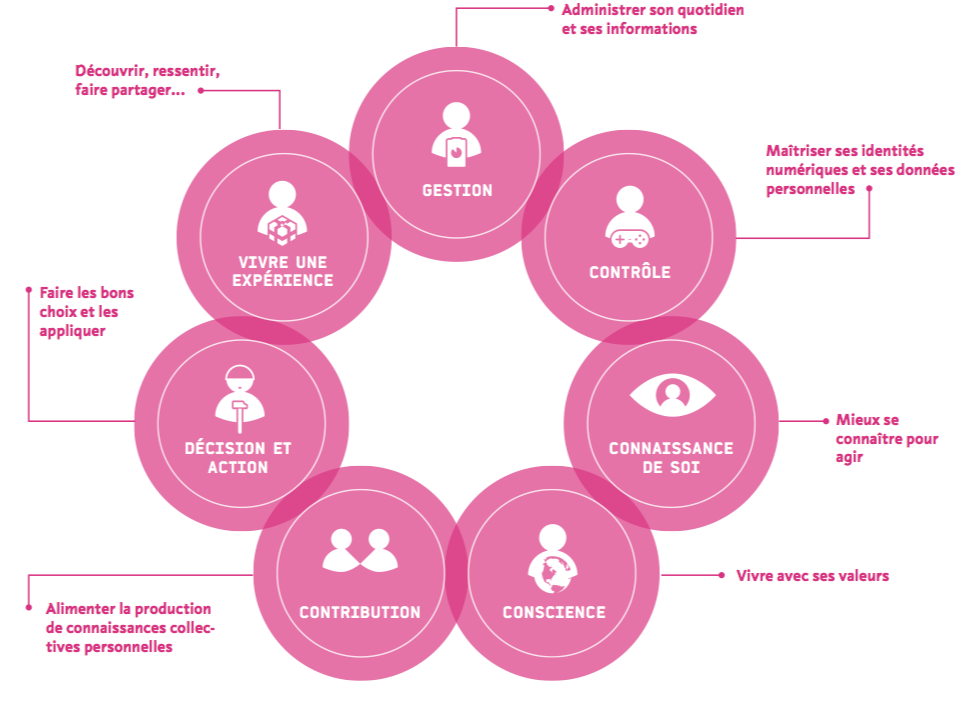

```{r knitr_init, echo=FALSE, cache=FALSE, message=FALSE, error=FALSE, warning=FALSE}
library(knitr)
library(rmdformats)

## Global options
options(max.print="75")
opts_chunk$set(echo=TRUE,
	             cache=TRUE,
               prompt=FALSE,
#               tidy=TRUE,
               comment=NA,
               message=TRUE,
               warning=TRUE)
opts_knit$set(width=75)

```

# Préambule

Ce document présente un guide pratique pour l'atelier sur le traitement et l'analyse des données avec **R**, présenté lors de la semaine Data-SHS 2021 organisé par la [PUD Grenoble](https://www.msh-alpes.fr/plateformes/pud-ga). 

Elle accompagne les supports de formation suivants :

- les [slides de la première journée](./jour1.html)
- les [slides de la deuxième journée](./jour2.html)
- le [script R](https://github.com/datactivist/IntroR_ODF/blob/master/script.R) reprenant les principales manipulations de données effectuées durant ces trois jours.


# Les matériaux nécessaires pour cette formation

- Une bonne connexion internet pour tous
- Un ordinateur par personne
- Toute la documentation de la formation : www.github.com/datactivist/introR_ODF

Pour le formateur : 

- préparer les démo

# Les étapes de la formation : 

## Première démo : 

Les participants renseignent le formulaire (https://forms.gle/dS3aX4jtHBMWvjjMA) qui demande des informations basiques sur les participants. 
Ce formulaire sert de démonstration des usages potentiels de R. 

Comment connecter un simple formulaire Google Form, ses données récoltées dans un tableur et les visualiser très simplement avec des petits modules de graphes ou de cartes sur une page HTML construite automatiquement. 

Le formateur a créé préalablement [un code R](https://github.com/datactivist/IntroR_ODF/blob/master/dashboard.Rmd) qui permet de visualiser en temps réel [un dashboard](./dashboard.html) qui présente les résultats. 

La force de R, c'est de permettre d'utiliser un code simple et concis (70 lignes dans ce cas). Il faut une heure à une heure et demi pour l'écrire.

## Les données

## Pourquoi s’intéresser à l'analyse des données ? 

La maîtrise de l'information est un élément essentiel du rapport au pouvoir (empowerment, donnée de capacités d'action)

- Professionnellement
- Personnellement, mouvement du [self data](http://mesinfos.fing.org/) : données pour reprise en main de certaines parties de sa vie. 

[](http://mesinfos.fing.org/selfdata/)

- Littératie de donnée 
- En tant que citoyen, déconstruire les algorithmes et se réapproprier les données qui servent à la décision publique

Les données ne signifient rien à l'état brut. C'est un modèle qui permet de les interpréter : on fait des hypothèses sur le rapport des données avec la réalité et on donne du sens aux données pour confirmer/infirmer ce modèle. 


### Accéder à la deuxième partie de cette formation, ["Utiliser R pour l’analyse et la visualisation de données"](./index2.html)
